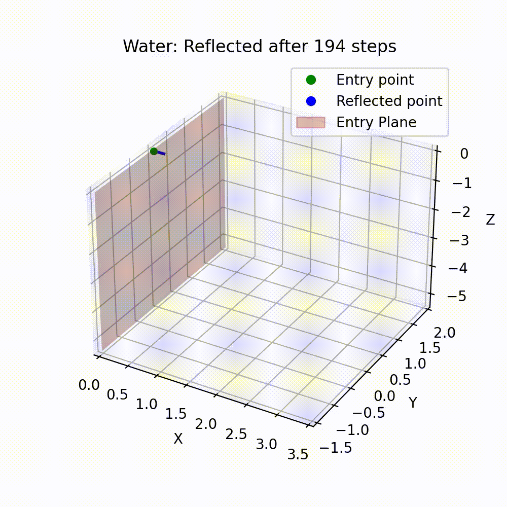
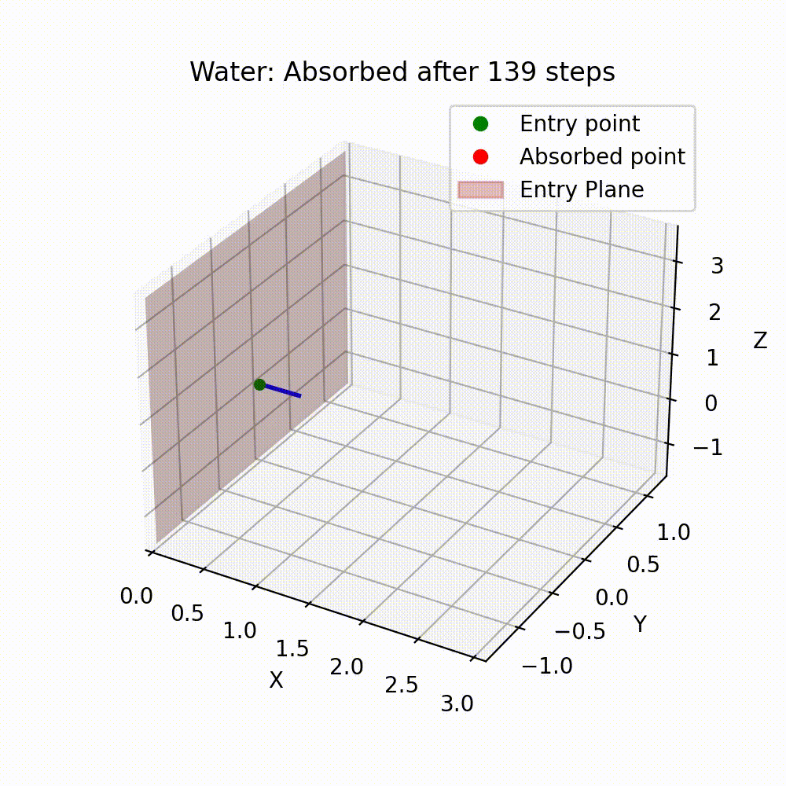
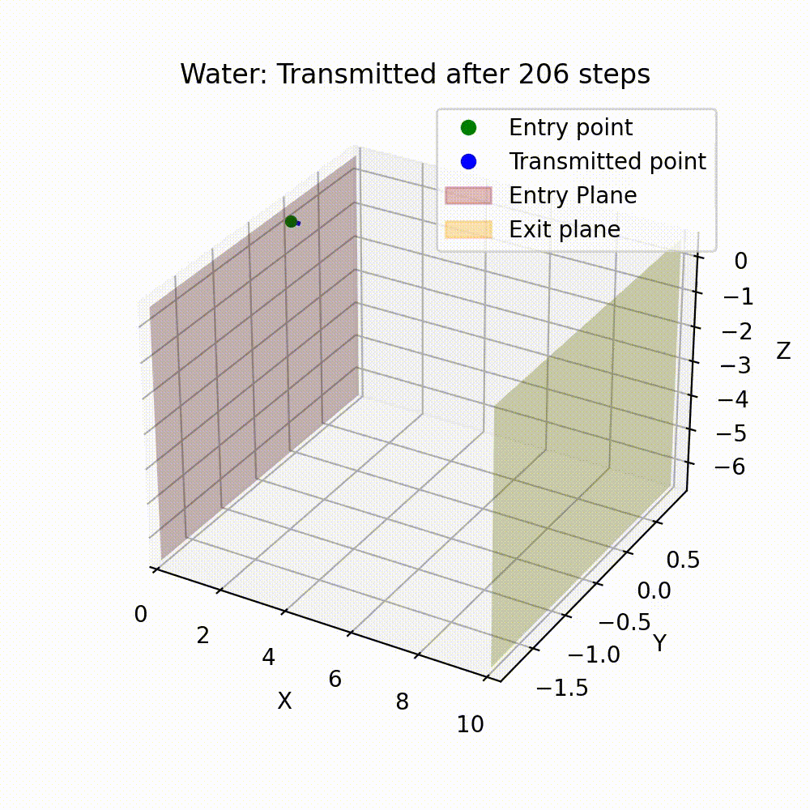

# Monte Carlo Simulations of Thermal Neutron Transport

    <figure style="width: fit-content;">
        
    </figure>
    <figure style="width: fit-content;">
        
    </figure>
    <figure style="width: fit-content;">
        
    </figure>

---

This repository features isotropic Monte Carlo simulations for thermal neutron transport, focusing on the evaluation of absorption, transmission, and reflection probabilities with associated uncertainties. We model thermal neutrons moving through a material slab characterized by its thickness and specific physical properties. The simulations are conducted for water, lead, and graphite.

This encompasses the computation of characteristic attenuation lengths via the Beer-Lambert law, spherical geometry adaptations, and two-material, varying-thickness simulations using the delta tracking technique. This method is adapted from:

> Woodcock, E. R., Murphy, T., Hemmings, P. J., and Longworth, T. C. “Techniques used in the GEM code for Monte Carlo neutronics calculations in reactors and other systems of complex geometry.” Technical Report ANL7050, Argonne National Laboratory (1965).

This notebook was created as a part of PHYS20762 at the University of Manchester.

To interactively run the notebook, click on the 'Open In Colab' badge above.
